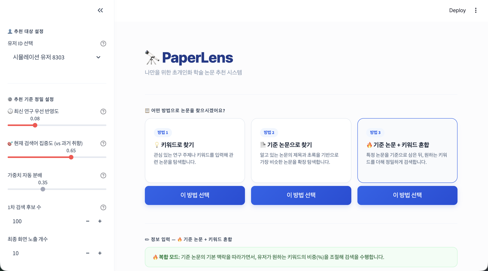
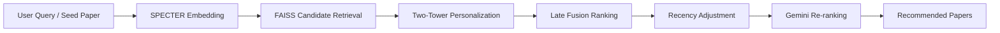

# PaperLens: arXiv RecSys

> Personalized and recency-aware paper recommendation system for academic literature discovery.

PaperLens is a Streamlit-based paper recommendation system that helps users discover arXiv papers based on both their current research intent and past preference patterns.  
The system combines semantic retrieval, Two-Tower personalization, recency-aware ranking, and LLM-based re-ranking to provide relevant paper recommendations with short explanations.


---

## Overview

Researchers often need to find relevant papers from a rapidly growing number of publications.  
PaperLens addresses this by recommending papers using:

- Natural language research queries
- Seed paper title / abstract
- User preference history
- Semantic paper embeddings
- Recency-aware ranking
- LLM-based final re-ranking and explanation

The final recommendations are not only semantically similar to the input query, but also personalized to the selected user profile.

---

## Key Features

- **Semantic Retrieval**  
  Retrieves candidate papers using SPECTER embeddings and FAISS.

- **Personalized Ranking**  
  Uses a Two-Tower model to reflect user-paper preference patterns.

- **Recency Control**  
  Allows users to adjust how strongly recent papers should be prioritized.

- **LLM Re-ranking**  
  Uses Gemini to re-rank top candidates and generate concise recommendation reasons.

- **Streamlit Demo App**  
  Provides an interactive interface for paper search and recommendation.

---

## System Pipeline



---

## Repository Structure

```text
.
├── app.py
├── twotower_score.py
├── evaluate_paperlens.py
├── requirements.txt
│
├── data/
│   └── paper_id_map.csv
│
├── two_tower/
│   ├── split_data.py
│   ├── train_two_tower.py
│   ├── data/
│   └── checkpoints/
│
└── eval_outputs/
```

---

## Required Files

To run the app, the following files are required:

```text
data/paper_id_map.csv
data/paper_embeddings.npy
data/papers_faiss.index
two_tower/checkpoints/best_two_tower_arxividx.pt
```

Due to file size, the following large artifacts are **not included in this repository**:

```text
data/paper_embeddings.npy
data/papers_faiss.index
```

Please contact the project authors to obtain these files before running the app.

---

## Installation

```bash
git clone <repository-url>
cd arXiv-Graph-RecSys
pip install -r requirements.txt
```

Create a `.env` file in the project root and add your Gemini API key:

```text
GEMINI_API_KEY=your_gemini_api_key
```

---

## Run

After placing the required files in the correct paths, run:

```bash
streamlit run app.py
```

---

## Evaluation

The project includes an offline evaluation script:

```bash
python evaluate_paperlens.py
```

Evaluation results are saved in `eval_outputs/`.

The evaluation includes:

- Recall@K
- NDCG@K
- HitRate@K
- Ablation analysis
- Personalization analysis
- Recency analysis

---

## Tech Stack

- Streamlit
- PyTorch
- FAISS
- SentenceTransformers / SPECTER
- Gemini API
- Pandas / NumPy
